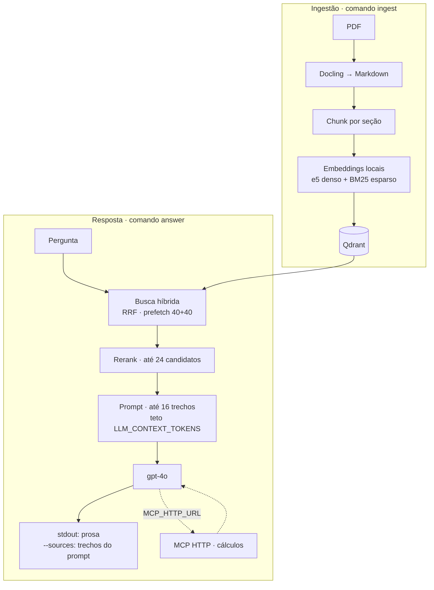

# eletric_motor


RAG de documentação técnica de motores elétricos. Pergunte em português — o sistema busca nos PDFs do acervo (manuais, guias e catálogos WEG) e responde em prosa contínua ancorada nos trechos recuperados.

## O que ele faz

- **Ingere PDFs técnicos**: extrai texto e tabelas com Docling, corta em chunks por seção (prosa até 800 tokens, sobreposição 100; tabela inteira em um chunk) e grava no Qdrant com metadados (tipo de fonte, fabricante, tópico, código de norma, idioma).
- **Busca híbrida**: vetor denso (`intfloat/multilingual-e5-large`, 1024 dimensões) + vetor esparso (BM25) fundidos com RRF. Filtros por metadado quando a pergunta pede.
- **Rerank**: cross-encoder local (`jina-reranker-v2-base-multilingual`) reordena os 24 trechos fundidos antes do corte — o trecho certo sobe sem precisar de limite alto.
- **Cache Redis**: pergunta repetida não reembeda, não reranqueia e não chama a API — a resposta vem do cache em milissegundos. Redis fora do ar não derruba nada.
- **Responde em prosa**: o LLM (gpt-4o) sintetiza com base nos trechos recuperados; a CLI imprime a resposta corrida e, com `--sources`, lista os trechos usados no prompt.
- **MCP opcional**: com `MCP_HTTP_URL`, o `answer` chama tools HTTP (corrente nominal, rendimento, Ip/In, validação NBR 5410) — ver [docs/MCP.md](docs/MCP.md).
- **Rastreável**: cada operação emite eventos JSON no stderr com `trace_id` único, da busca à resposta (ver [docs/Tracing.md](docs/Tracing.md)).
- **Idempotente**: reingerir o mesmo PDF não duplica pontos; metadados mudados são atualizados sem reembedar.

## Arquitetura

Há **dois fluxos**: ingestão grava PDFs no Qdrant; consulta lê a coleção e responde. O `query` só lista trechos (sem LLM). O `answer` reranqueia, monta o prompt e chama o gpt-4o; com `MCP_HTTP_URL`, o mesmo fluxo pode invocar o servidor MCP antes da resposta final. Redis cacheia embedding da pergunta e resposta pronta — ver [Cache](#cache).



**Trace:** cada execução emite linhas JSON no **stderr** com o mesmo `trace_id` (cache, retrieve, rerank, `generate.mcp.tools_called` se MCP, `generate.answered` — ou só cache em hit de resposta). Detalhes em [Observabilidade](#observabilidade).

## Estrutura

```text
├── compose.yaml              # Qdrant, Redis e MCP (opcional)
├── pyproject.toml            # Python 3.13+, workspace uv (RAG + mcp/)
├── mcp/                      # Pacote eletric-motor-mcp (FastMCP HTTP)
├── data/
│   ├── weg/                  # PDFs WEG (não versionados)
│   └── norms/                # Normas (não versionados)
├── docs/                     # Um .md por módulo de rag/ (ver Documentação)
├── src/eletric_motor/
│   ├── __init__.py           # CLI: init-collection, ingest, query, answer
│   └── rag/
│       ├── collection.py     # Criação idempotente da coleção híbrida
│       ├── ingest.py         # Extração Docling (TableFormer fast)
│       ├── chunk.py          # Corte por seção, idioma, tópico
│       ├── embeddings.py     # fastembed: e5-large denso + BM25 esparso
│       ├── store.py          # Upsert idempotente, refresh de payload
│       ├── search.py         # Busca híbrida com fusão RRF
│       ├── rerank.py         # Cross-encoder que reordena os trechos
│       ├── answer.py         # Prompt, chamada ao LLM, prosa e cache de resposta
│       ├── mcp_answer.py     # answer + tool calling MCP (HTTP)
│       ├── cache.py          # Cache Redis de embedding e resposta
│       ├── settings.py       # Configuração via ambiente/.env
│       └── trace.py          # Log JSON estruturado
└── tasks/                    # Specs de cada fase implementada
```

## Tecnologias

| Peça | Uso |
|---|---|
| Python 3.13 + uv | Linguagem e gerenciador de pacotes |
| Qdrant (Docker) | Banco vetorial, coleção híbrida densa + esparsa |
| Redis (Docker) | Cache de embedding e de resposta |
| Docling | Extração de PDF para Markdown (tabelas em modo fast) |
| fastembed | Embeddings locais: e5-large (denso) e BM25 (esparso) |
| LangChain + langchain-openai | Orquestração e chamada ao gpt-4o |
| Pydantic v2 | Modelos congelados e validação de configuração |

## Pré-requisitos

- Python 3.13+ e [uv](https://docs.astral.sh/uv/)
- Docker (Qdrant e Redis sobem pelo `compose.yaml`)
- Chave da OpenAI (só para o comando `answer`)

## Como rodar

```bash
# 1. Instalar dependências (RAG + MCP)
uv sync --all-packages

# 2. Subir Qdrant e Redis (MCP: terminal local ou docker compose service mcp)
docker compose up -d

# 3. Configurar ambiente (para respostas com LLM)
cp .env.example .env
# Edite .env e defina OPENAI_API_KEY (e opcionalmente MCP_HTTP_URL)

# 4. Criar a coleção (idempotente)
uv run eletric-motor init-collection

# 5. Ingerir PDFs (WEG em data/weg/; norma ABNT em data/norms/ se registrada em chunk.py)
uv run eletric-motor ingest data/weg/weg-manual-geral-iom-50033244.pdf
uv run eletric-motor ingest data/norms/NBR-5410.pdf

# 6. (Opcional) Servidor MCP para cálculos determinísticos
uv run --directory mcp eletric-motor-mcp
# No .env: MCP_HTTP_URL=http://127.0.0.1:8000/mcp

# 7. Perguntar (adicione --sources para ver os trechos usados no prompt)
uv run eletric-motor answer "como dimensionar condutores para motor trifásico"
```

## Uso

| Comando | O que faz |
|---|---|
| `init-collection` | Cria ou confere a coleção híbrida e os índices de payload |
| `ingest CAMINHO` | Extrai um PDF, corta em chunks e grava na coleção |
| `query PERGUNTA` | Lista os trechos mais relevantes (sem LLM, não gasta API) |
| `answer PERGUNTA` | Responde com o LLM em prosa (`--sources` lista trechos do prompt) |

**Flags comuns** (`query` e `answer`):

| Flag | Efeito |
|---|---|
| `--no-cache` | Ignora Redis nesta execução (reembeda a pergunta; no `answer`, refaz rerank/LLM/MCP) |
| `--limit N` | Trechos retornados (padrão 8 no `query`, 16 no `answer`) |

**Filtros de metadado** (ambos): `--source-type manual|guia|norma`, `--manufacturer weg`, `--topic instalacao`, `--norm-code 5410`, `--language pt-BR`.

**Só `query`:** `--rerank` liga o cross-encoder (desligado por padrão).

**Só `answer`:** `--no-rerank` desliga o rerank; `--sources` lista os trechos enviados ao prompt após a resposta.

Cache Redis ligado por padrão; use `--no-cache` para testar sem hit (alternativa local a `FLUSHALL` — ver [Cache](#cache)). Desligar globalmente: `CACHE_ENABLED=false` ou `--no-cache` por comando.

```bash
uv run eletric-motor answer "como calcular a corrente de rotor bloqueado" --source-type guia
uv run eletric-motor answer "requisitos da NBR 5410 para motores" --norm-code 5410 --sources
uv run eletric-motor answer "corrente nominal 10 kW 380 V trifásico" --no-cache
uv run eletric-motor query "fator de serviço" --no-cache
```

## Configuração

Variáveis de ambiente ou arquivo `.env` (não versionado):

| Variável | Padrão | Função |
|---|---|---|
| `OPENAI_API_KEY` | — | Chave da OpenAI (obrigatória para `answer`) |
| `LLM_MODEL` | `gpt-4o` | Modelo da resposta |
| `LLM_CONTEXT_TOKENS` | `12000` | Teto de tokens dos trechos no prompt |
| `QDRANT_URL` | `http://localhost:6333` | Endereço do Qdrant |
| `QDRANT_COLLECTION` | `eletric_motor` | Nome da coleção |
| `EMBEDDING_THREADS` | todos os núcleos | Limite de CPU do embedding e do reranker |
| `MODEL_CACHE_DIR` | `~/.cache/fastembed` | Onde os ~3 GB de modelos ficam salvos |
| `RERANKER_MODEL` | `jinaai/jina-reranker-v2-base-multilingual` | Cross-encoder do rerank |
| `RERANK_CANDIDATES` | `24` | Trechos fundidos enviados ao reranker |
| `REDIS_URL` | `redis://localhost:6379` | Endereço do Redis |
| `CACHE_TTL_S` | `86400` | TTL do cache em segundos |
| `CACHE_ENABLED` | `true` | `false` desliga o cache |
| `MCP_HTTP_URL` | — | URL do MCP (ex. `http://127.0.0.1:8000/mcp`); liga tools no `answer` |

Referência completa em [docs/Settings.md](docs/Settings.md). Servidor MCP: [docs/MCP.md](docs/MCP.md).

## Documentação

Cada módulo de `src/eletric_motor/rag/` tem sua referência em `docs/`, na ordem do pipeline:

[Collection](docs/Collection.md) → [Ingest](docs/Ingest.md) → [Chunk](docs/Chunk.md) → [Embeddings](docs/Embeddings.md) → [Store](docs/Store.md) → [Search](docs/Search.md) → [Rerank](docs/Rerank.md) → [Answer](docs/Answer.md)

Transversais: [Settings](docs/Settings.md) (configuração), [Tracing](docs/Tracing.md) (log estruturado), [Cache](docs/Cache.md) (Redis) e [MCP](docs/MCP.md) (cálculos HTTP).

## Observabilidade

A resposta vai para o stdout; o trace JSON vai para o stderr. Para inspecionar:

```bash
uv run eletric-motor answer "..." 2> trace.log
```

Cada execução usa um `trace_id` único. Em um `answer` completo (sem hit de cache de resposta), o stderr costuma trazer `cache.lookup`, `retrieve.hybrid.completed`, `rerank.completed` e, com `MCP_HTTP_URL`, `generate.mcp.tools_called` antes de `generate.answered`. Se a resposta vier do Redis (`cache_scope=answer`, `cache_hit=true`), só aparece `cache.lookup` — não há retrieve nem generate naquela execução. O `query` emite retrieve (e rerank, se `--rerank`). Formato e campos em [docs/Tracing.md](docs/Tracing.md).

## Cache

Para ver o cache em ação, rode a mesma pergunta duas vezes e observe o stderr: na segunda, `cache.lookup` vem com `"cache_hit": true` e a resposta sai em segundos, sem chamar a API.

Para **forçar miss** numa execução só (sem apagar o Redis), use `--no-cache` no `query` ou no `answer`.

```bash
# Inspecionar as chaves e o TTL restante
docker compose exec redis redis-cli KEYS '*'
docker compose exec redis redis-cli TTL "answer:<hash>"

# Limpar o cache (força miss na próxima execução)
docker compose exec redis redis-cli FLUSHALL

# Resiliência: com o Redis parado, tudo funciona sem cache (1 warning no trace)
docker compose stop redis
uv run eletric-motor query "o que é fator de serviço"
docker compose start redis
```

Detalhes em [docs/Cache.md](docs/Cache.md).

## Roadmap

- [x] Coleção híbrida no Qdrant
- [x] Ingestão de PDFs (Docling, chunking, dois vetores)
- [x] Consulta híbrida com filtro de metadado
- [x] Resposta do LLM em prosa ancorada no acervo
- [x] Redis: cache de embedding e de resposta
- [x] Reranker `jina-reranker-v2-base-multilingual` (cross-encoder local via fastembed)
- [x] MCP (Fase 1–2): pacote `mcp/`, servidor HTTP, tools P0+P1 — ver [docs/MCP.md](docs/MCP.md)
- [x] MCP (Fase 3): `answer` com `MCP_HTTP_URL` (cliente HTTP)
- [x] `calcular_queda_linha` (dimensional, task 010)

## Notas

- Os PDFs em `data/` e o arquivo `.env` não são versionados.
- O catálogo impresso da linha W22 não traz as tabelas de dados elétricos (a WEG aponta para o catálogo eletrônico); perguntas por valores nominais de um modelo específico dependem de ingestão futura desses dados.
